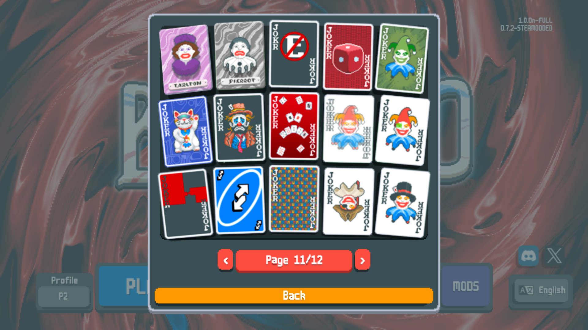
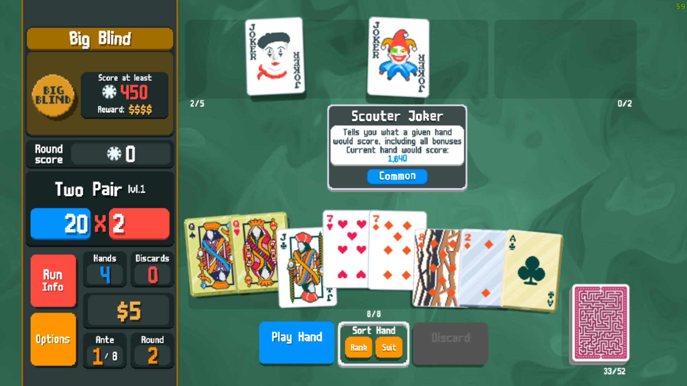
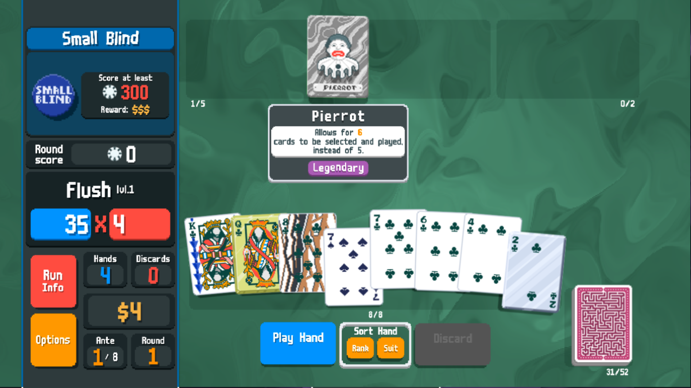
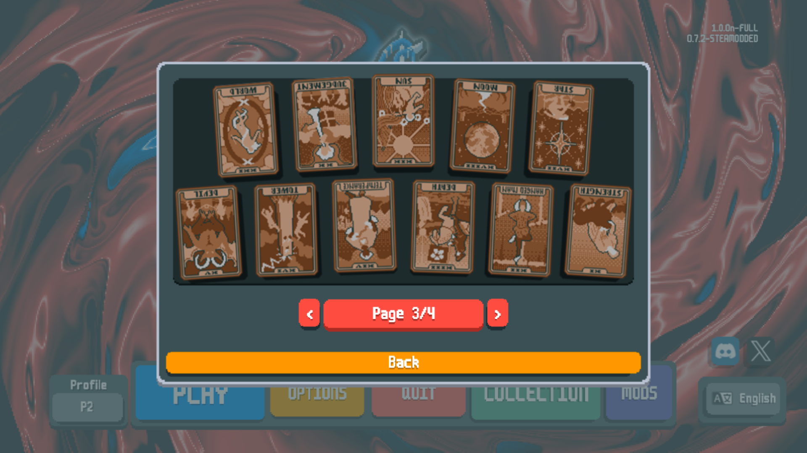
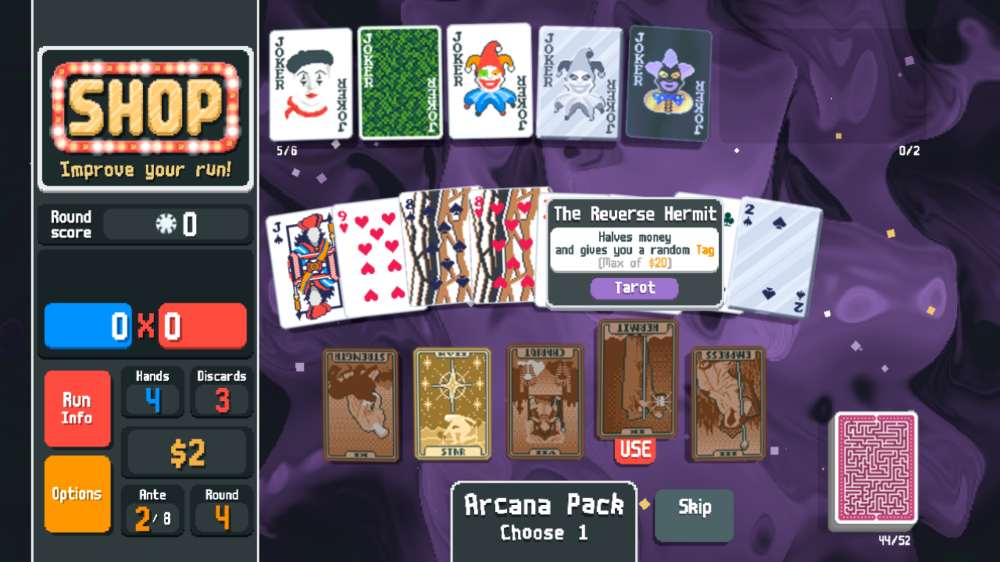
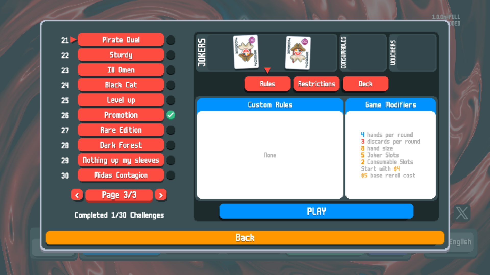

# JellyMod
A mod for balatro that adds 31 new jokers (including 2 new legendary cards!), reverse tarot cards, and some new challenges.

Requires [Steammodded](https://github.com/Steamopollys/Steamodded)

Go to [releases](https://github.com/jamesthejellyfish/JellyMod/releases), download JellyMod.zip, unzip and place all files in C:/Users/your username/AppData/Roaming/Balatro/Mods/ (you may have to make this folder)
- For just the reverse tarot cards, download JellyTarots.zip, and for just the jokers, download JellyJokers.zip

# Compatibility Warning
- This mod makes significant changes to base functions that exist in the game. Because of this, this mode will likely not be compatible with other mods without significant tweaking.
- JellyMod has been tested with Steamodded version 0.7.2. More recent versions may break this mod.

Credit to [LushMod](https://github.com/lusciousdev/LushMod) for some of the code used for porting this mod over to Steamodded.

# Features:
- 31 new jokers, including 2 new Legendaries!
- For more info on the Jokers, click [Here](Jokers.md)

- 22 new "Reverse" Tarot cards, which do thematically similar things to their right-side-up counterparts, but with a fun twist
- For more info on the Tarot Cards, click [Here](Tarots.md)

- 10 new challenges to show off the fun synergies that the new jokers and tarots have.

# Contributing:
If you would like to contribute, make a PR and describe the nature of your contribution, and I may merge it in!
## Localization
If you know another language and would like to localize Jellymod into your language, you can make a PR after performing the following steps:
  1. add your language to the list of supported_languages in the game_modificatins.lua file
  2. add a new folder to the "localization" folder with the name of your translated language (i.e. "ru")
  3. add tarots.lua, enhancements.lua, jokers.lua, and vouchers.lua to the folder
  4. copy the localizations from the respective files, make your translations, and then return the changes from each file
  5. use the russian translation (provided by @aigiz010 on Discord) as a reference.
To use the localizations, simply change your language to the desired one and reset the game.  
